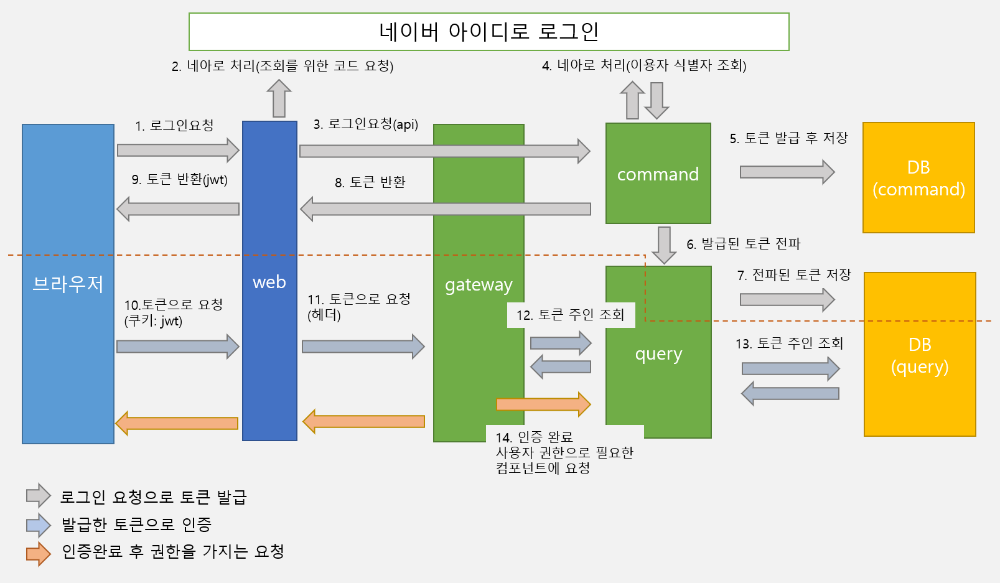
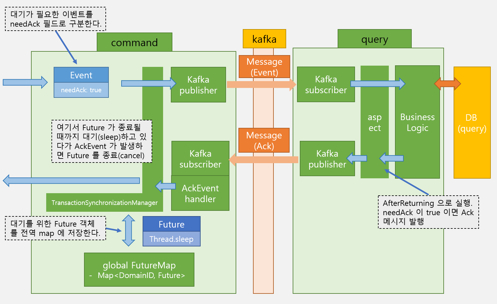

# 클로즈메모

- 메인: https://closememo.com

## 1. 개요

- 클로즈메모는 웹기반 메모장입니다. 카테고리와 태그로 분류가 가능하고 검색이 편한 메모장을 만드는 것을 목표로 시작했습니다.
- 실험적인 성격이 강한 프로젝트입니다.
- 개발인원 1명.

## 2. 구조

- 클로즈메모는 Front-end 컴포넌트 1개와 Back-end 컴포넌트 6개로 운영되고 있으며, 부가적으로 Kafka, Elasticsearch, MariaDB 를 사용하고 있습니다.
- Back-end 컴포넌트는 kubernetes 환경에서 구동하고 있습니다.
- Jenkins, Nexus, ArgoCD 를 통해 테스트/빌드/배포를 진행합니다.

### 2.1 구현에 참고한 설계 방법론 및 기술

- CQRS: 클로즈메모는 CQRS 구조를 채용했습니다. 쓰기를 위한 모듈과 읽기를 위한 모듈이 분리되어 있으며, DB 또한 분리하였습니다.
  + 쓰기모듈: `command`
  + 읽기모듈: `query`
- MSA: 클로즈메모는 MSA 를 지향합니다. 추가적인 기능의 경우 독립적인 컴포넌트로 분리합니다.
  + 현재 6개의 컴포넌트가 존재 (`gateway`, `command`, `query`, `admin`, `mailsender`, `autotag`)
  + 운영/배포를 위해 kubernetes 사용
  + HTTP와 kafka로 통신
- 메시지 기반 설계
  + 클로즈메모는 핵심 컴포넌트를 메시지 기반 설계를 기초로 구성하였습니다.
  + Spring Integration (Enterprise Integration Patterns) 을 통해 경량 메시지를 구현합니다.
  + 컴포넌트 사이의 메시지 전달은 kafka 를 이용합니다.
- DDD & Event Sourcing
  + 클로즈메모의 핵심 컴포넌트 `command` 는 DDD 의 개념을 기본으로 구현되었습니다.
  + 도메인에서 발생한 변경사항을 Event 로 전달하고 수정이 필요한 다른 도메인으로 비동기적으로 전파하여 갱신하도록 합니다.
- ORM
  + JPA 를 기본으로 사용하고 있습니다.

### 2.2 컴포넌트별 상세 설명

#### 2.2.1 Front-end

- `web`: https://github.com/closememo/web 
  + React 와 Express 로 구동합니다.
  + SSR(Server side rendering)을 지원합니다.
  + Apollo server 의 역할을 하고 있습니다.
  + 인증과 JWT(Json web token)을 처리합니다.

#### 2.2.2 Back-end 

- `gateway`: https://github.com/closememo/gateway
  + spring cloud 를 사용합니다.
  + HTTP 요청을 경로에 따라 라우팅합니다.
  + 요청에 대해 인증하고 권한을 전달합니다.
- `command`: https://github.com/closememo/command
  + CQRS 의 C 역할을 하여 CUD 요청에 대한 처리를 담당합니다.
  + DDD 를 기본으로 구현되었습니다.
  + 대부분의 비즈니스 로직을 포함하고 있습니다.
- `query`: https://github.com/closememo/query
  + CQRS 의 Q 역할을 하여 Read 요청에 대한 처리를 담당합니다.
  + 조회 요청에 적절한 DTO 를 만들어 반환합니다.
  + 읽기 전용 필드 처리를 위한 로직을 포함하고 있습니다.
- `admin`: https://github.com/closememo/admin
  + 관리자를 위한 기능을 구현합니다.
- `mailsender`: https://github.com/closememo/mailsender
  + 압축 파일을 만들고 메일을 전송하는 역할을 합니다.
  + spring-boot-starter-mail 를 사용합니다.
- `autotog`: https://github.com/closememo/autotog
  + 사용자가 작성한 메모를 한국어 형태소 분석기로 분석하여 빈도수를 기본으로 태그로 적당한 단어를 추천합니다. 

#### 2.2.3 infra

- RDBMS: MariaDB
  + 세 DB 를 분리해서 사용합니다: 쓰기 전용(command), 읽기 전용(query), 관리자용(admin)
- Messaging: Kafka
  + 컴포넌트간 이벤트 전달을 위해 사용합니다.
- Search Engine: Elasticsearch
  + '태그로 검색' 기능을 위해 사용합니다.
  + 각 컴포넌트에서 발생하는 로그도 ES 에 저장하고 있습니다. (filebeat, logstash)
- CI/CD: Jenkins
  + 코드 변경에 따라 테스트하고, Docker 이미지를 만들고, manifest 파일을 수정합니다.
- Nexus
  + Docker 이미지 관리를 위한 private docker registry 역할을 합니다.
- ArgoCD
  + Kubernetes 환경에서의 운영을 위해 사용합니다. github 의 manifest 파일을 바탕으로 무중단 배포를 수행합니다.

### 2.3 CQRS 상세

- CUD(create/update/delete) 요청과 R(read) 요청을 구분하며 URL 경로로 구분됩니다.
- CUD 요청
  + `gateway` 에서 `command` 모듈로 라우팅합니다
  + `command` 모듈에서 도메인 단위에서 생성/변경/삭제를 수행하고 DB 에 저장합니다.
  + 도메인의 생성/변경/삭제 이벤트를 발생시키고 kafka 를 통해 `query` 모듈로 전파합니다.
  + `query` 모듈에서 읽기전용 DB 에 반영합니다. 이 때, 읽기 전용 필드가 있다면 `query` 에서 처리합니다.
- R 요청
  + `gateway` 에서 `query` 모듈로 라우팅합니다.
  + `query` 에서 읽기전용 DB 를 조회합니다. 이 때, 요청에 적절한 DTO 단위로 반환합니다.

### 2.4 메시지 처리 상세

- `command` 모듈은 메시지 기반으로 설계되었습니다.
- 메시지는 크게 Command 와 Event 로 구분합니다.
  + Command: 도메인 모델을 변경 요청. ex) CreateDocumentCommand
  + Event: 도메인 모델이 변경됨을 알림. ex) DocumentCreatedEvent
- Command 는 CommandHandler 에서 subscribe 하며 각 handler 를 시작으로 비즈니스 로직을 처리합니다.
- Event 는 모듈 내부적으로는 EventListener 에서 subscribe 하며 필요한 후처리를 수행하며, 추가적으로 도메인 모델을 수정할 필요가 있다면 Command 를 발생시킵니다. ex) Document 가 새로 생성되어 Category 의 count 를 늘려야 한다면 IncreaseCategoryCountCommand 발생.
- Event 발생시 외부 모듈에도 전파해야 하는데 이때는 kafka 를 이용합니다.
  + spring-integration-kafka 를 사용합니다.
  + `command` 모듈의 kafka publisher 에서 kafka 메시지를 발송합니다.
  + `query` 모듈의 kafka subscriber 에서 메시지를 받아 읽기전용 DB 에 반영합니다. 이 때, 읽기 전용 필드를 위한 추가적인 처리가 필요하다면 수행합니다.

### 2.5 운영 인프라 상세

#### 2.5.1 Nexus

- 각 모듈은 docker image 로 빌드되고 이를 기반으로 kubernetes 에 배포됩니다. image 를 저장할 필요가 있어서 사설 docker repository 로서 nexus 를 사용하고 있습니다.

#### 2.5.2 Jenkins

- github organization 기능을 사용하며, 각 컴포넌트의 Jenkinsfile 을 각 레포지토리에서 관리합니다.
- 각 컴포넌트의 수정사항이 github 에 반영되면 Jenkins 에서 테스트를 실행하고, 테스트가 통과하면 후속 작업을 수행합니다.
  + 테스트에 통과한 컴포넌트를 docker 이미지로 만들어 private docker repository(nexus) 에 push 합니다.
  + dev 환경에 배포하기 위해 kubernetes manifest 파일을 수정하여 github 에 push 합니다. (real 환경은 수동)
  + 수정된 manifest 파일은 Argo CD 에 의해 kubernetes 에 반영됩니다.

#### 2.5.3 Argo CD

- Argc CD 를 통해 kubernetes에 배포를 수행합니다.
- kubernetes manifest 파일은 github 레포지토리에서 관리합니다.
  + manifest 파일 관리 레포지토리: https://github.com/closememo/manifest

## 3. 개발 중 발생한 특별한 이슈

아래는 개발 중 발생한 이슈 중 특이했던 이슈들과 그 해결 방법들입니다.

### 3.1. 로그인 처리시 컴포넌트간 동기화 문제

- 키워드: kafka, Future, 동기화

#### 이슈개요

클로즈메모는 CQRS 기반이기 때문에 갱신과 조회가 DB 단위에서 분리된 구조입니다. 때문에, DB간 동기화에 시간이 걸립니다. 그래서 짧은 기간 내에 동기화가 필요한 경우 문제가 발생할 수 있습니다.

로그인 처리가 그러한 경우입니다. 특히 "네이버 아이디로 로그인" 같은 외부 로그인 API 를 사용하는 경우 응답시간이 일정하지 않아서 동기화 되기까지 단순히 대기 시간을 늘리는 것으로는 해결이 어렵습니다.

아래는 현재 클로즈메모의 로그인 구조에 대한 설명입니다.

|  |
|:---:|
| 클로즈메모의 로그인 구조 |

위에서 볼 수 있듯이 DB 두 개가 분리되어 있기 때문에 토큰 정보 동기화(DB 양쪽 모두 저장)가 충분히 빠르게 이루어지지 않으면 토큰 기반 로그인 처리에서 `command` 에서 발급한 토큰이 `query` 에 반영되기 전에 브라우저에서 조회가 발생시 권한 획득을 실패할 수 있습니다.

#### 해결방법

동기화가 필요한 경우 `command` 에서 동기화 완료 메시지를 받을 때까지 대기하는 방식으로 해결해 보았습니다.

kafka 의 경우 producer 가 subscribe 완료 여부를 알수 없어서 양방향으로 메시지를 주고 받도록 하고, 응답 메시지를 받기까지 Future 객체를 통해 스레드가 대기하도록 하였씁니다.   

|  |
|:---:|
| 양방향 Kafka 통신과 Future 를 이용한 대기 처리 |

- kafka 를 양방향으로 사용합니다.
  + `command` -> `query`: Event 전달
  + `query` -> `command`: 반영이 완료되었다는 Ack message
- 대기를 위해 Future 객체를 사용하여 Thread.sleep() 을 수행합니다.
- 로그인 시도하는 유저에 대한 ID 를 key 로 하는 전역 map 에 Future 를 저장합니다. 
- TransactionSynchronizationManager 를 통해 Transactional 어노테이션으로 구분되는 메소드를 실행 단위가 되도록 합니다.
  + 여기서 대기하다가 kafka 로 부터 응답을 받거나 timeout 이 지나면 Future 가 실행되는 Thread 를 끝내고 프로세스를 진행

### 3.2. 거의 동시에 들어오는 요청에 대한 transaction 처리

- 키워드: spring, transaction, aop, lock, synchronized

#### 이슈개요

클로즈메모의 `command` 모듈에서는 메시지기반 구조를 이용합니다. 이 때, 들어오는 다수의 메시지를 동시적으로 처리하기 위해 ThreadPoolTaskExecutor 를 통해 여러 thread 를 관리합니다. 그런데, 이 경우 일관성에 대한 문제가 발생할 수 있습니다.

아래는 현재 구조와 문제가 발생하는 부분에 대한 설명입니다.

|  |
|:---:|
| 문제가 발생하는 기존 구조 |

거의 동시에 같은 도메인 객체를 수정에 대한 요청이 들어오는 경우 DB 일관성 문제가 생길 수 있습니다.

- Command 마다 Thread 를 할당받아 사용
- 각 Thread 에서는 @Transactional 어노테이션을 사용하지만, 어노테이션은 Thread 범위만 보장하기 때문에 다른 Thread 와의 동기화는 해결되지 않음
- 한 도메인 객체에 대하여 동시에 다수의 Thread 가 실행 될 때, DB 일관성이 깨질 수 있음

#### 해결 

|  |
|:---:|
| Aspect 와 Lock 을 추가하여 수정한 구조 |

Aspect 와 Lock 을 이용하여 Thread 사이의 동기화 문제를 해결하였습니다.

- DB 에서 수정이 대상이 되는 도메인 아이디를 key 로 하는 전역 map 를 만듦
- 각 비즈니스 로직 실행 시 aop 를 이용하여 같은 도메인 객체를 수정하게 되는 경우 lock 을 사용하여 동기화를 수행

### 3.3. Pod 단위 로그 수집

- 키워드: kubernetes, pod, sidecar 패턴

#### 이슈개요

kubernetes 으로 운영시 별도의 처리가 없다면 각 컴포넌트에서 application 이 만든 로그 파일이 보존되지 않습니다.

#### 해결

지난 로그를 기록하고 검색에 용이하기 위해서 로그를 elasticsearch 에 저장하는 것이 좋다고 생각해서 구현해 보았습니다.

|  |
|:---:|
| 로그 수집을 위한 kubernetes 와 ELK 구조 |

- ELK 스택
  + 로그 기록 및 조회를 위해 logstash, elastic, kibana 를 사용합니다.
- filebeat
  + sidecar 패턴을 참고하였습니다.
  + 각 컴포넌트 pod 에 spring application 과 volume 을 공유하는 filebeat 컨테이너를 함께 구동합니다.
  + application 에서 로그를 파일형태로 공유 volume 에 작성하면 filebeat 에서 실시간으로 logstash 로 전송합니다.
- spring logback 설정
  + ELK 스택에 적절한 포맷을 위해 logstash-logback-encoder 를 사용합니다. (json 형태로 로그 기록)

## 4. 사용기술

### 4.1. Front-end

- javascript, typescript, react, express, graphql, apollo

### 4.2. Back-end

- Java, spring(boot, cloud, integration), JPA

### 4.3. Database

- MariaDB

### 4.4. CI/CD

- Jenkins

### 4.5. Infra

- kafka, elasticsearch, filebeat, logstash, kubernetes, argocd

### 4.6. methodology

- CQRS, Message-driven, Event-sourcing, DDD, GitOps
